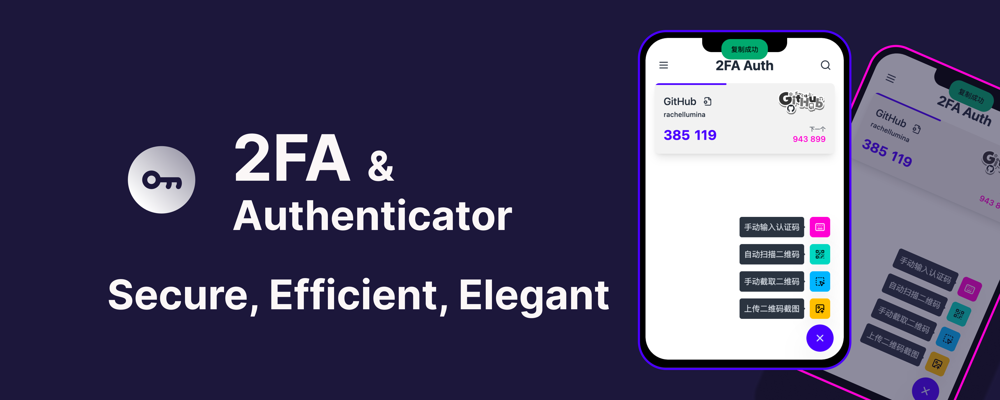

 

# TOTP 双因素验证器 — 让登陆验证更简单更安全

  <a href="https://chromewebstore.google.com/detail/iibjpaihhbdpicdgckhbikknalgeekph" target="_blank">
     Chrome 商店安装
  </a>
  
一款专为安全与效率打造的开源免费 2FA 扩展，支持二维码自动扫描、选区扫描、表单输入与上传二维码，轻松应对多平台账户管理，界面优雅、体验出色。

  
  [English](./README.en-US.md) | 简体中文

## 🚀 功能亮点

你是否经常在不同网站登录时被 2FA 验证搞得头大？要么切 App、要么翻手机，还得自己输验证码，繁琐又麻烦？😵‍💫
别急，**Authenticator 🧩** 插件来拯救你！它是一款**通用型 TOTP 二步验证器**，安装到浏览器中即可随时查看验证码，无需切换页面，无需掏出手机！

简洁优雅的界面 + 极速访问体验 ✨
让你**登录验证快人一步，不再手忙脚乱！**

开启无忧验证，就靠这一个扩展！🔐⚡️

### 核心功能

- ✅ 支持多平台账号，多样化数据录入：二维码自动扫描、手动输入、导入截图，轻松便捷。
- 🔗 深度集成 GitHub、NPM 等平台，实现无缝验证码填充。
- 🎨 多款主题色自由切换，界面更个性更舒适。
- 💾 支持存储恢复码，快速恢复账号安全保障。
- 🆓 完全开源免费，代码透明，安全可信赖。
- 更多功能持续开发中...

## 快速开始

## 欢迎使用 2fa-auth

如果在使用过程中遇到问题，或者有新功能的需求，欢迎在 **issues** 中反馈，我们会及时跟进！🚀

## 🛠️ 开源与贡献

本项目基于开源协议，欢迎任何形式的参与和贡献！
如果你有建议、BUG反馈或者想参与开发，请提交 Issue 或 Pull Request。

1️⃣ **安装 Node.js** 👉 [下载地址](https://nodejs.org/en/download/package-manager)  
2️⃣ **安装依赖**：`npm i`  
3️⃣ **构建项目**：`npm build`  
4️⃣ **打包扩展**：`npm package`

