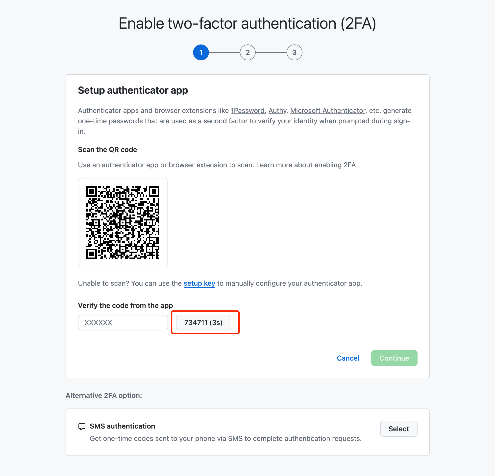
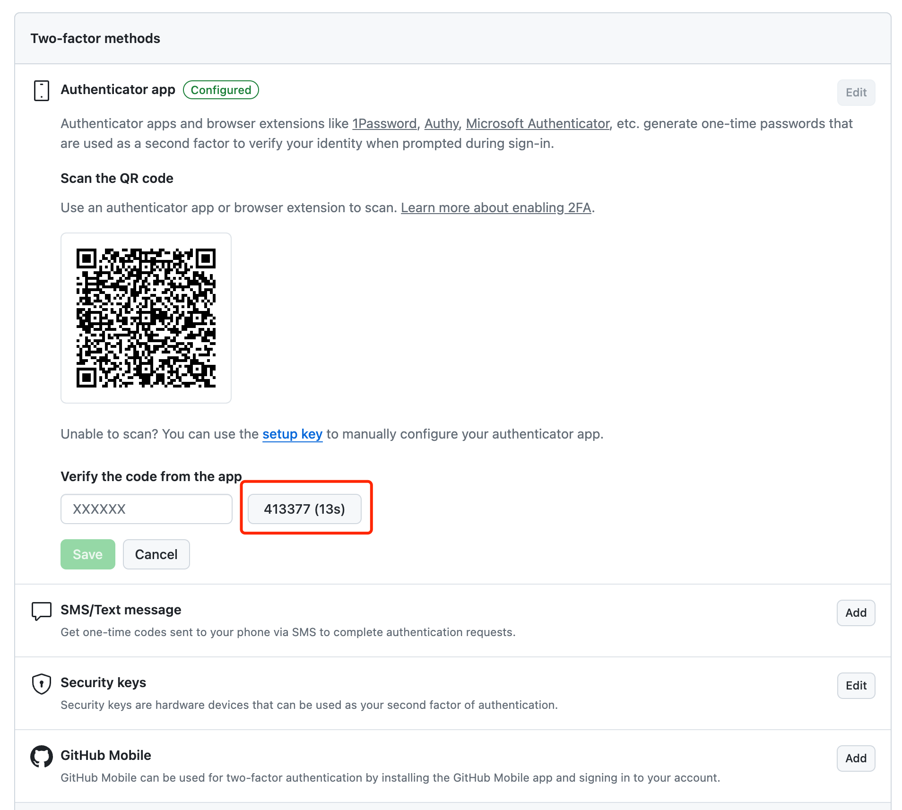
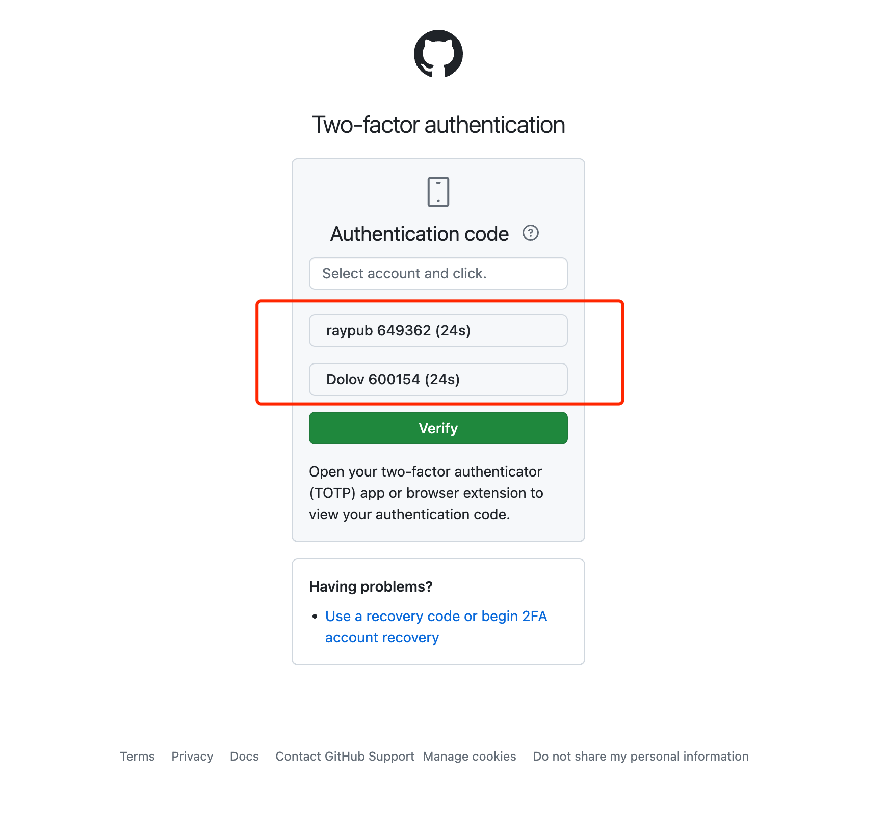
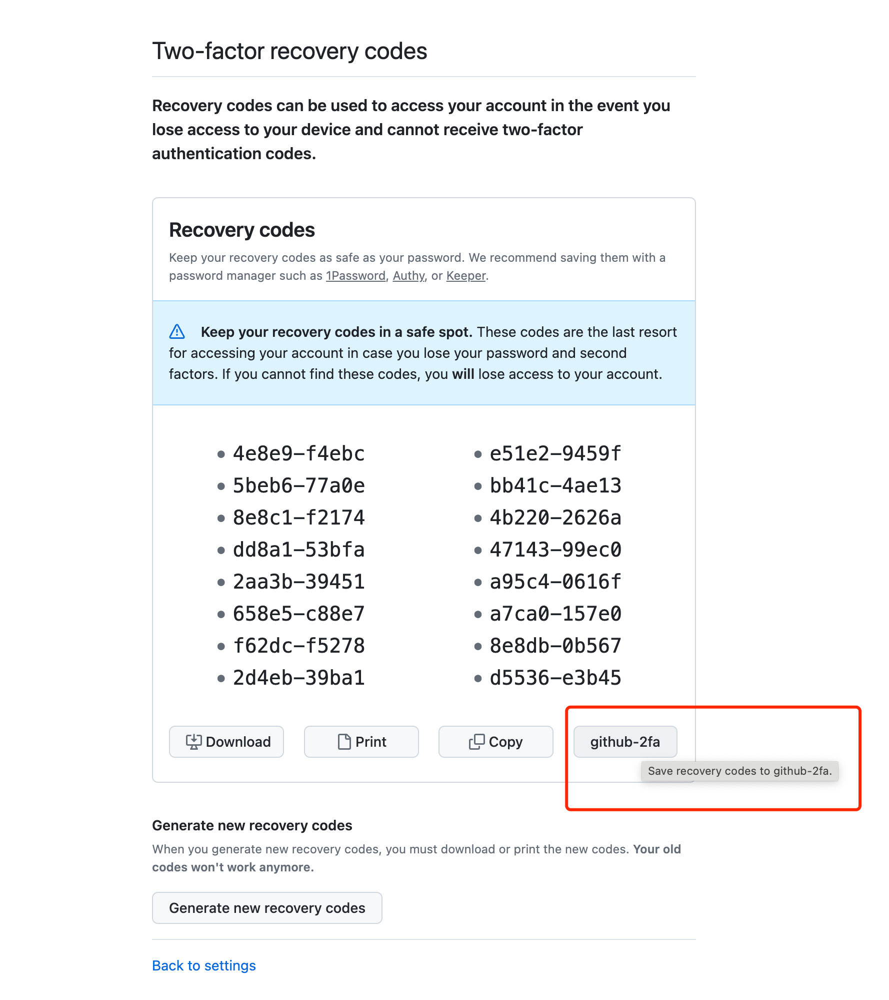
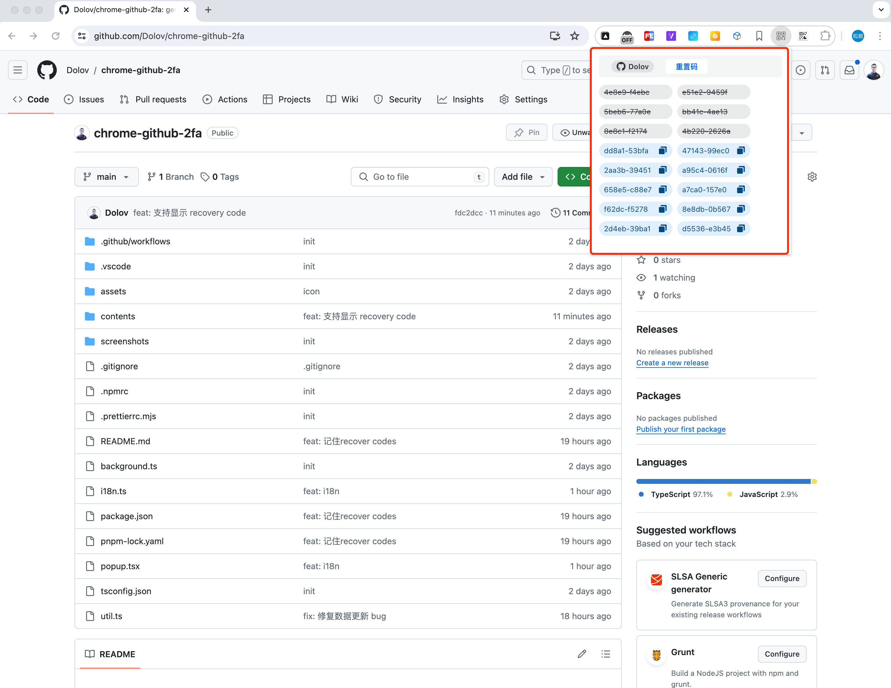
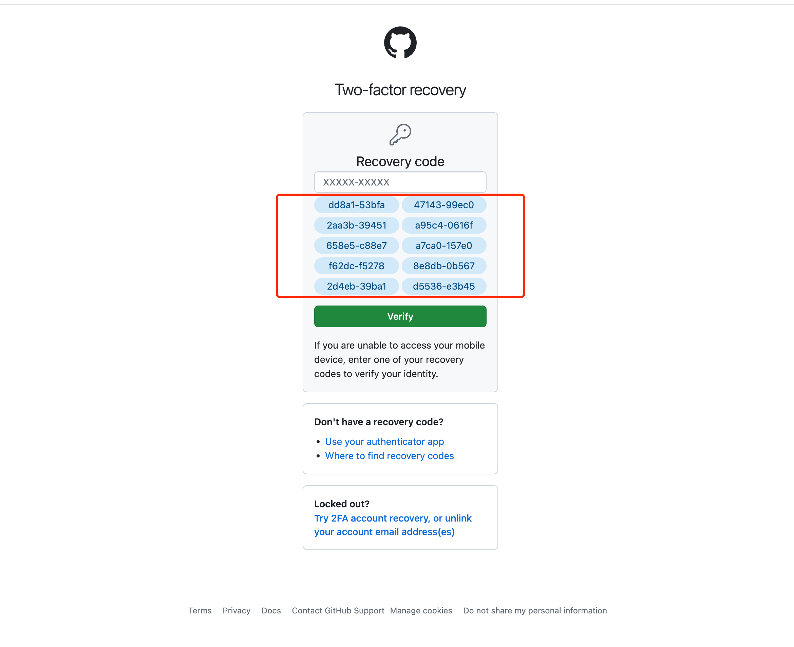

# 🚀 Easy GitHub 2FA Authentication

让 GitHub 双重验证（2FA）变得前所未有的简单与高效！

## ✨ 主要功能

- **自动识别 GitHub 2FA 二维码**  
  一键扫描页面上的 2FA 二维码，自动生成动态验证码，无需手动输入。

- **一键填充验证码**  
  登录 GitHub 时，自动检测并填充 2FA 验证码，极大提升登录效率。

- **多账号管理**  
  支持同时管理多个 GitHub 账号的 2FA 信息，切换自如。

- **恢复码安全存储与管理**  
  可安全保存 GitHub 恢复码，并记录每个恢复码的使用状态，防止丢失。

- **极简美观 UI**  
  设计简洁，操作直观，极致用户体验。

- **本地数据加密**  
  所有敏感信息均加密存储于本地，保障数据安全。

---

## 🖼️ 截图预览

### 设置 2FA 验证码

### 登录自动填充

### 恢复码管理

---

## 🛠️ 如何使用

1. **安装扩展**  
   [点击这里前往 Chrome 应用商店安装](https://chromewebstore.google.com/detail/github-2fa/lhmckpbbfjnkbgekjinmhpcaojjiifcd)

2. **添加 GitHub 账号 2FA**

   - 打开扩展，扫描 GitHub 提供的 2FA 二维码，或手动输入密钥。
   - 可为多个账号分别添加 2FA 信息。

3. **自动登录体验**

   - 登录 GitHub 时，扩展会自动检测并填充 2FA 验证码，无需手动切换应用。

4. **恢复码管理**
   - 在扩展中保存恢复码，随时查看和管理使用状态，防止丢失。

---

## 💡 为什么选择本扩展？

- 再也不用手动输入 2FA 验证码
- 多账号无忧切换
- 恢复码不再丢失
- 数据本地加密，安全可靠
- 极简 UI，极致体验

---

## 📄 相关链接

- [Chrome 应用商店](https://chromewebstore.google.com/detail/github-2fa/lhmckpbbfjnkbgekjinmhpcaojjiifcd)
- [使用文档 & 常见问题](https://github.com/Dolov/chrome-github-2fa/issues/1)

---

欢迎体验，提升你的 GitHub 安全与效率！  
如有建议或问题，欢迎在 [GitHub Issues](https://github.com/Dolov/chrome-github-2fa/issues) 反馈。

---

如需英文版或进一步定制内容，请告知！
