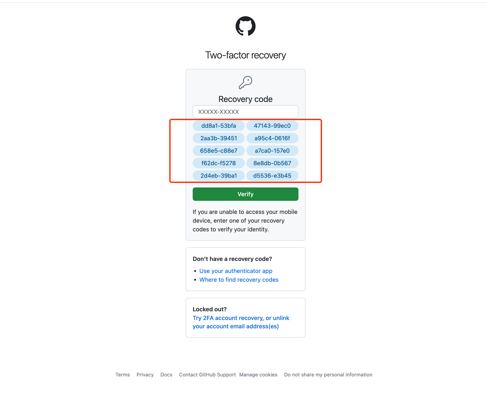

# Easy GitHub 2FA authentication

Say goodbye to the hassle of 2FA verification by integrating our solution seamlessly into your workflow. Enjoy enhanced security and convenience as you navigate GitHub with ease.

### Feature
- Ready to use out of the box, no configuration required.
- Automatically detects the QR code on the page, generates dynamic 2FA codes, and inserts them into the page.
- Can save Recovery Codes to the plugin, record their usage status to prevent loss.
- Can store data for multiple GitHub accounts.
- Features an exquisite and minimalist UI, simple operation, and ensures data security.

### Set 2FA Code

### Login With Authentication

### Save recovery codes

### Welcome to use